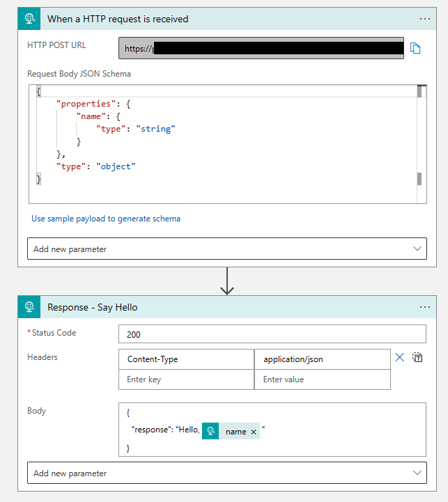

# tf-logicapp-consumption

Creates a simple Logic App (Consumption) workflow with no network restrictions.

#### Terraform Resources:

- [azurerm_logic_app_workflow](https://registry.terraform.io/providers/hashicorp/azurerm/latest/docs/resources/logic_app_workflow)
- [azurerm_logic_app_trigger_http_request](https://registry.terraform.io/providers/hashicorp/azurerm/latest/docs/resources/logic_app_trigger_http_request)
- [azurerm_logic_app_action_custom](https://registry.terraform.io/providers/hashicorp/azurerm/latest/docs/resources/logic_app_action_custom)

#### Workflow:

The workflow receives an HTTP POST request in JSON with a parameter of `name`, then responds with `"Hello", {name}"` in a JSON format.



#### Testing

Using cURL:

```bash
URL="" # Set to the `app_url` output value from Terraform
NAME="World"
curl -H "Content-Type: application/json" -X POST -d "{\"name\":\"$NAME\"}" $URL
```

Expected response:

`{"response":"Hello, World"}`
